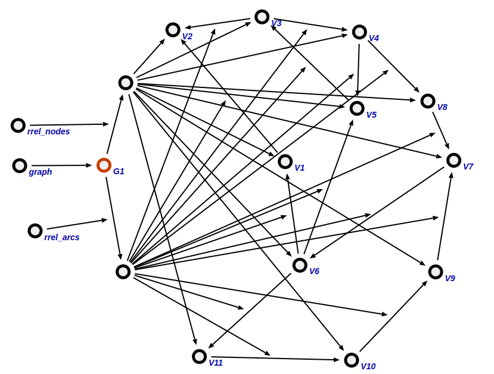
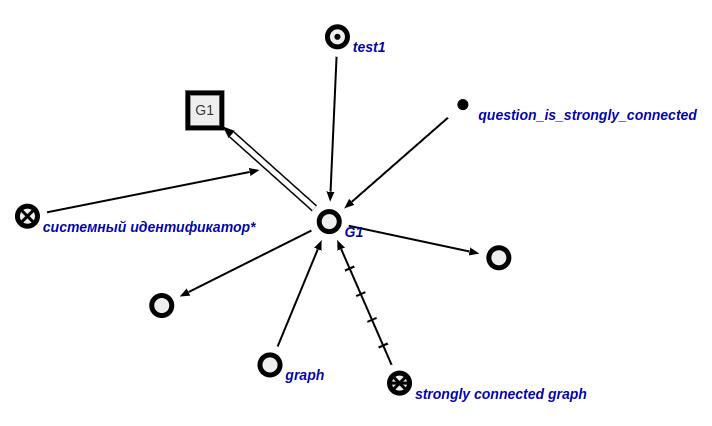
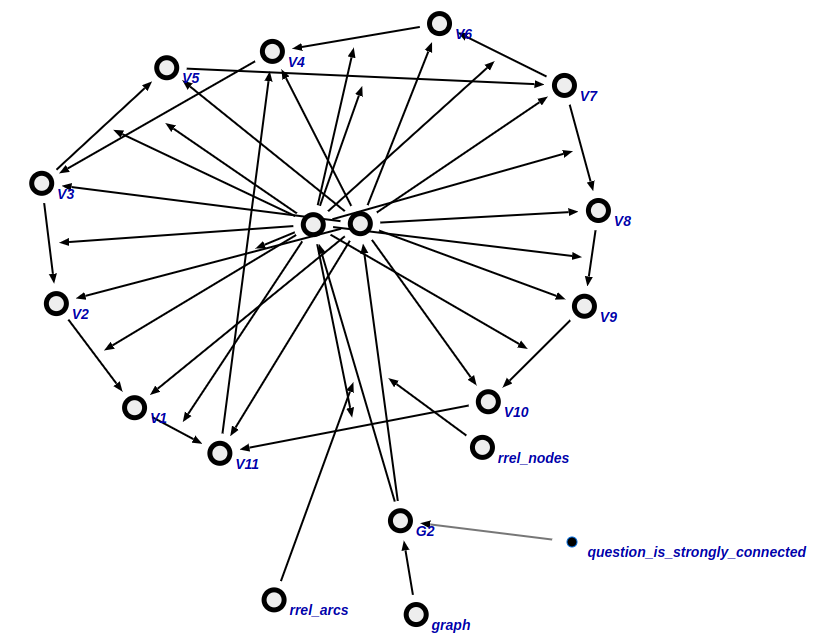
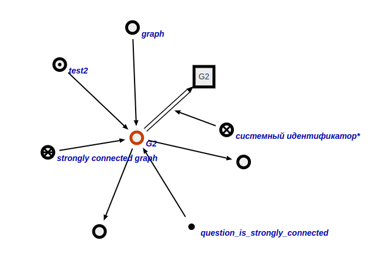

### Agent for checking a graph for strongly connectedness

The task of this agent is a check of the graph for strongly connected

#### Work example 1

**Request:**

**Response:**

#### Work example 2

**Request:**

**Response:**
